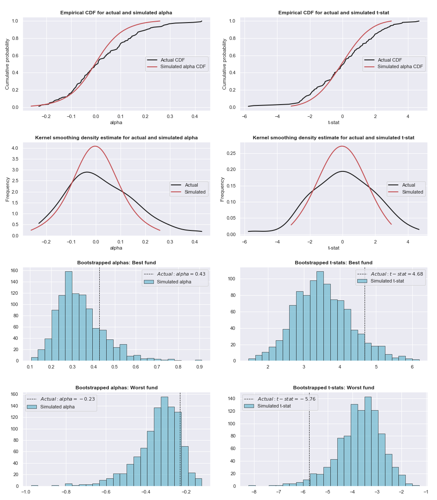

# Fama-French-Funds
An exercise similar to Fama, French (2010). Goal is to identify and evaluate the luck vs skill of active managers.
## Data

Factor datasets are available at Ken French's website [here](http://mba.tuck.dartmouth.edu/pages/faculty/ken.french/data_library.html).

Fund data must be self provided.

## Actual vs Simulations: Percentile Comparisons
Fama-French style comparisons of actual fund returns to the percentiles of
simulated fund returns. Tables contain the actual percentiles of fund returns and
the mean percentile simulated returns at increasing levels of assumed alpha variance.
The charts contain cdf plots, kde plots, and histograms for the best and worst funds.

### Global Funds
#### 3 Factor Model
* alpha: [table](tables/Global-3factor-alphas.csv)
* t-statistics: [table](tables/Global-3factor-tstats.csv)

### EM Funds
#### 3 Factor Model
* alpha: [table](tables/EM-3factor-alphas.csv)
* t-statistics: [table](tables/EM-3factor-tstats.csv)

## Acknowledgements
Original idea was to replicate a Fama, French (2010) finding for given dataset. The base structure of the code is borrowed
from a master's thesis by Kyjell Jorgensen and rewritten from Matlab into Python.  

## References
[Fama, French (2010). "Luck versus Skill in the Cross-Section of Mutual Fund Returns." The Journal of Finance, Vol. LXV, No. 5.](http://citeseerx.ist.psu.edu/viewdoc/download?doi=10.1.1.479.3099&rep=rep1&type=pdf)

Jorgensen, Kyjell (2016). "Distinguishing between skill and luck in the returns of Norwegian mutual funds." BI Norwegian Business School.
